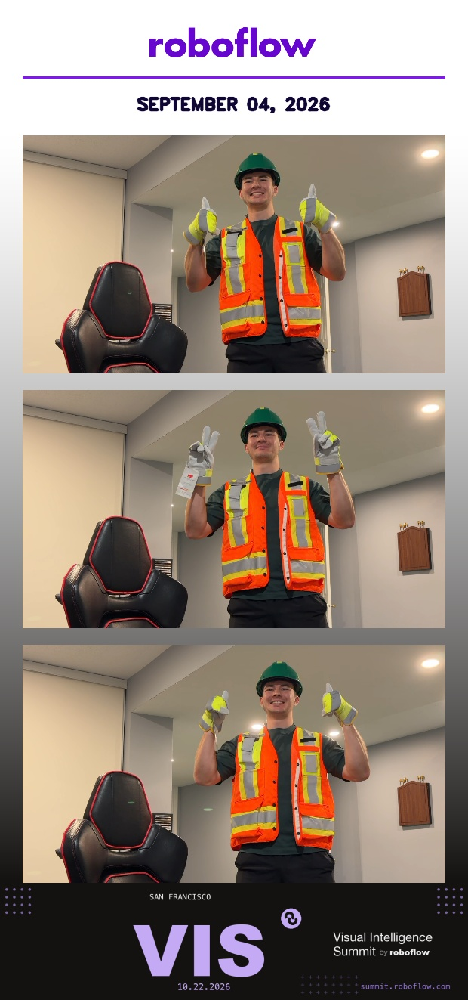

# Site Safety Photobooth — Roboflow edition

Scan your conference pass, pass the PPE check, get a branded photobooth strip
emailed to you.

## Flow

1. **SCAN** — guest holds their badge up to the camera. The booth OCR-reads
   the text on it (Apple Vision, on-device — printed or handwritten names both
   work) and fuzzy-matches every word against the registrant list in
   `attendees.json` (OCR slips like "Alcx" still match). Only registered names
   activate the booth; their email comes from the same list.
2. **GEAR** — the booth checks hardhat, vest, gloves on the guest and calls
   out anything missing.
3. **READY** — once fully geared, the corner target appears; hold a hand in
   it for 1.2 s to arm.
4. **SHOOT** — countdown (default 3 s, `--countdown 10` for the long version),
   then three photos with a flash.
5. **RESULT** — Roboflow-branded strip (purple header, PPE VERIFIED badge
   with the guest's name, roboflow logo footer) shows on screen, saves to
   `photos/`, and is emailed to the guest.

The booth resets to SCAN after each guest, or after 15 s with nobody in frame.

## Run

```bash
../.venv/bin/python photobooth.py
```

Options: `--camera 1`, `--required hardhat,vest`, `--countdown 10`,
`--speak` (foreman voice — OFF by default), `--voice Grandpa`, `--no-mirror`.

## Demo passes & registrants

```bash
../.venv/bin/python make_pass.py --name Alex --handwritten
```

writes `pass_alex.png` — print it or show it on a phone (`--handwritten`
renders the name in a handwriting font; any badge with the name visible works,
including one written with a marker). The registrant list is
`attendees.json` (`"name": "email"`) — that's where the real address list
gets configured later.

## Email

Configured via `../.env`:

```
SMTP_HOST=smtp.gmail.com
SMTP_PORT=587
SMTP_USER=you@gmail.com
SMTP_PASSWORD=<app password>
```

For Gmail, create an App Password (Google Account -> Security -> 2-Step
Verification -> App passwords) — your normal password won't work. Until SMTP
is configured, strips queue to `outbox/` with a log of who they were for.

## Branding

The strip uses Roboflow purple (#8315F9) and navy (#100633). The logo footer
is a drawn wordmark by default — drop an official `roboflow_logo.png` in this
folder and it will be used instead.

## Example output



## Adding yourself as a registrant

1. Add your name and email to `attendees.json`, e.g. `"sam": "sam@example.com"`
   (names are matched case-insensitively, with fuzzy tolerance for OCR slips).
2. Make a scannable pass: `../.venv/bin/python make_pass.py --name Sam --handwritten`
   — or just write your name on paper with a marker.
3. Run the booth, hold the pass up to the camera, gear up, and follow the prompts.
